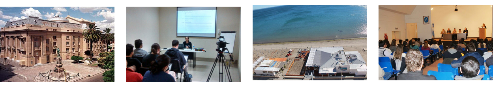
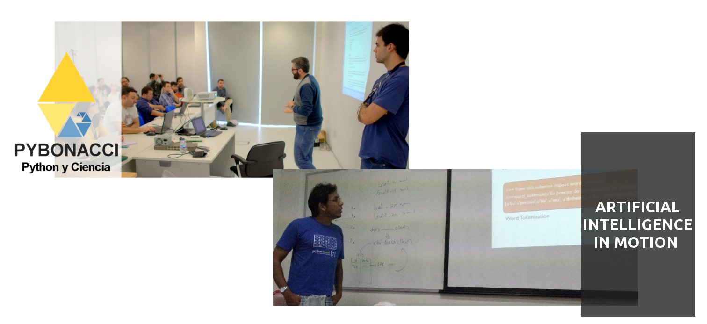

.. =============================================================================
.. HEADER
.. =============================================================================

.. header::

    .. image:: img/head.png
        :align: center
        :scale: 90 %

    **Conferencia Latinoamericana de Computación Científica con Python**

    http://conf.scipyla.org

.. =============================================================================
.. CONTENT
.. =============================================================================

.. class:: center

    **La conferencia está orientada a la divulgación de herramientas y/o**
    **proyectos realizados con Python en el ámbito científico, académico e**
    **industrial.**

.. Figure:: img/map.png
    :align: center
    :scale: 80 %

    Universidad Gastón Dachary - Colon y Salta, Posadas, 3300, Argentina

Actividades Programadas:
^^^^^^^^^^^^^^^^^^^^^^^^

.. class:: center

    Talleres, Charlas, Sessión de Posters y Keynotes

    **Inscripción Online** http://conf.scipyla.org (cupos limitados)

Conferencias Anteriores
^^^^^^^^^^^^^^^^^^^^^^^

    Bahía Blanca, 2014 - SciPyCon Argentina 2014 -
    Puerto Madryn, 2013 - SciPyCon Argentina 2013

Exponentes Internacionales
^^^^^^^^^^^^^^^^^^^^^^^^^^

.. class:: center

    **Juan Luis Cano** y **Kiko Correoso** Autores del
    Blog Científico Pybonacci (http://pybonacci.org)

    Kiko (izquieda) y Juan Luis (derecha) brindando una charla en
    PyCon España 2014

Organizan
^^^^^^^^^

.. image:: img/sponsors.png
    :align: center
    :scale: 80 %

