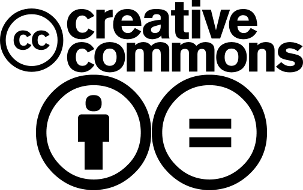

=============
Acerca de ...
=============

SciPy Latin America 2015 - Post-Mortem por SciPyLa se
encuentra bajo una licencia
`Creative Commons Atribución-SinDerivadas 3.0 Unported <http://creativecommons.org/licenses/by-nd/3.0/deed.es>`_.

Referencias
-----------

- Este documento: http://scipyla2015.readthedocs.org
- Fuentes de este documento: https://github.com/scipy-latinamerica/scipyla2015
- Pagina web del evento: http://www.scipyla.org/conf/2015/
- SciPy Latin America: http://scipyla.org
- Pycon Argentina 2012 - Post-Mortem: http://pyconar20012-postmortem.readthedocs.org

Objetivo y estructura de este documento
---------------------------------------

Este documento se deja como referencia a la posteridad para futuros
organizadores de SciPy Latin América

Fue inspirado en los reportes final de *PyCon Argentina 2012*,

La estructura que se estableció para los capítulos se desprende de los
siguientes criterios:

- Objetivos de la conferencia (como el caso del track teen)
- Independencia con otras áreas (como el caso de lo administrativo)
- Factores críticos (proveedores)
- Feedback (Todos los artículos relacionados con opiniones)

Todas las referencias aquí citadas se encuentran debidamente enlazadas en el
apartado *Referencias* de este mismo capítulo.

Staff
-----

SciPy Latin America es organizada por un grupo de voluntarios dedicados y con
experiencia en la comunidad internacional de Python Científico. El núcleo del
comité de organización consiste en:

- **Coordinador General:** Juan B. Cabral <jbc.develop@gmail.com>
- **Coordinador de Charlas:** Damián Avila <damianavila@gmail.com>
- **Coordinador de Becas:** Nestor Navarro <nestornav@gmail.com>
- **Responsable de Speakers Internacionales:** Celia Cintas <ccintas@gmail.com>
- **Coordinador en UGD:** Roberto Suenaga <rsuenaga@ugd.edu.ar>
- **Editor del Post-Mortem:** Juan B. Cabral <jbc.develop@gmail.com>
- **Redactores del Post-Mortem:**
    - Juan B. Cabral <jbc.develop@gmail.com>

Nuestro reconocimiento para los voluntarios y empresas que participan del
evento colaborando con la organización:

- **Logo:** Paula Lorca <paulalorca89@hotmail.comHo>
- **Arte:** Salvador Bravo <ta3kaiserhotmail.com@gmail.com>
- **Infraestructura y Redes:** Universidad Gastón Dachary

.. only:: latex

    Made with `Sphinx <http://sphinx-doc.org/>`_!
