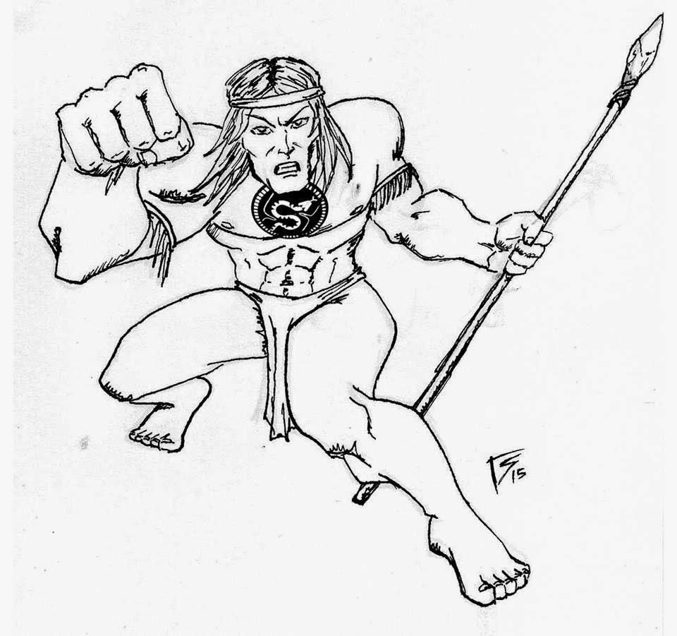

Palabras del Coordinador General
================================

Este documento es una de las tareas mas arduas, tediosas y útiles de toda la
organización; ya que sirve de autocrítica, evaluación y herramienta de mejora
para el futuro.

Aprovecho estas lineas para agradecer el tremendo esfuerzo realizado para que
la conferencia haya sucedido. Este esfuerzo no solo vino por parte de la
organización sino también de mis padres y amigos.

Ya paso casi un mes de la finalización de la conferencia en la ciudad de
Posadas y cuatro años de que con Celia, Nahuel y Damián discutimos "esto" de
hacer una  conferencia de Python científico, basándonos en el éxito del
`track que llevamos adelante en PyCon Argentina 2012 <http://pyconar20012-postmortem.readthedocs.org/en/latest/ciencia.html>`_.

Esto suma un total de 3 conferencias en tres puntos bastante distantes de la
Argentina que demostró que estamos llenando un hueco que las comunidades de
programadores estaban ignorando: La de programar con el objetivo de mejorar
la ciencia.

Los siguientes años la conferencia no solo ya nos excede a los promotores
originales sino también al país donde la gestamos. Ahora le toca
el turno a Brasil. Ojalá nos superen.

Juan B Cabral

